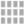
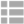

material-ui-customizable-icons
=======================

## [Material-UI Customizable Icons](https://gasite.in.ua/open-source/material-ui-customizable-icons/)

A set of minimalistic customizable material design SVG-icon components for React.


## Requirements

- [Node](https://nodejs.org) 7.5.0 or newer (not tested on earlier versions)
- [Typescript](https://www.typescriptlang.org) 2.1.5 or newer (not tested on earlier versions)
- [Babel](https://babeljs.io) 6.2.2 or newer (not tested on earlier versions)


## Required Knowledge

I recommend that you get to know [React](http://facebook.github.io/react/) and [Material-UI](http://material-ui.com/).

## Installation
```sh
npm i material-ui-customizable-icons --save
```

## Usage
Once installed, just import and use the component:
```javascript
import React from 'react';
import Active from 'material-ui-customizable-icons/Active';

const className = 'custom-icon';
const viewBox = '0 0 48 48';
const transform = 'scale(2)';
const style = {
  width: '48px',
  height: '48px',
};
const pallet = {
  circle: 'rgba(169, 169, 169, 1)',
  tick: 'rgba(255, 255, 255, 1)',
};

const Example = () => (
  <Active
    className={className}
    style={style}
    transform={transform}
    pallet={pallet}
  />
);

export default Example;
```


#### Common Properties
| Props        | Options           | Default  | Description |
| ------------- |-------------| -----| -------- |
| className | String | '' | Adds custom class to SVG container.|
| style | Object | {} | Adds custom inline styles to SVG container. |
| viewBox | String | '0 0 24 24' | Defines view-box attribute of SVG container.|
| transform | String | '0 0 24 24' | The transform property applies a 2D or 3D transformation to an element.|
| pallet | Object | {} | Component-specific colors pallet. |

#### Components list and their specific pallets:
| Component        | Preview           | Pallet properties to specify colors for |
| ------------- |-------------| -----| -------- |
| Active |  | circle, tick |
| Inactive |  | circle, tick, crossing |
| ChevronUp |  | primary |
| ChevronDown |  | primary |
| ChevronLeft |  | primary |
| ChevronRight |  | primary |
| ArrowUp |  | primary |
| ArrowDown |  | primary |
| ArrowLeft |  | primary |
| ArrowRight |  | primary |
| CaretUp |  | primary |
| CaretDown |  | primary |
| CaretLeft |  | primary |
| CaretRight |  | primary |
| ViewArticles |  | primary |
| ViewGrid |  | primary |
| ViewHeadlines |  | primary |
| ViewList |  | primary |
| Hamburger |  | primary |
| Edit |  | primary |
| Clear |  | primary |
| Save |  | primary |
| Delete |  | cap, bucket, cross |
| MoveUp |  | arrow, strip |
| MoveDown |  | arrow, strip |
| MoveLeft |  | arrow, strip |
| MoveRight |  | arrow, strip |
| Search |  | stick, ring |
| SearchPlus |  | stick, ring, plus |
| SearchMinus |  | stick, ring, minus |
| Github |  | cat, ring |


## Contribute

1. [Submit an issue](https://github.com/gordienkotolik//material-ui-customizable-icons/issues)
2. Fork the repository
3. Create a dedicated branch (never ever work in `master`)
4. The first time, run command: `yarn` into the directory
5. Fix bugs or implement features


## Future
- Fix distribution type definitions to handle "import {...} from 'material-ui-customizable-icons'" imports
- Add tests
- Add examples directory


## License
This project is licensed under the terms of the
[MIT license](https://github.com/gordienkotolik//material-ui-customizable-icons/blob/master/LICENSE)